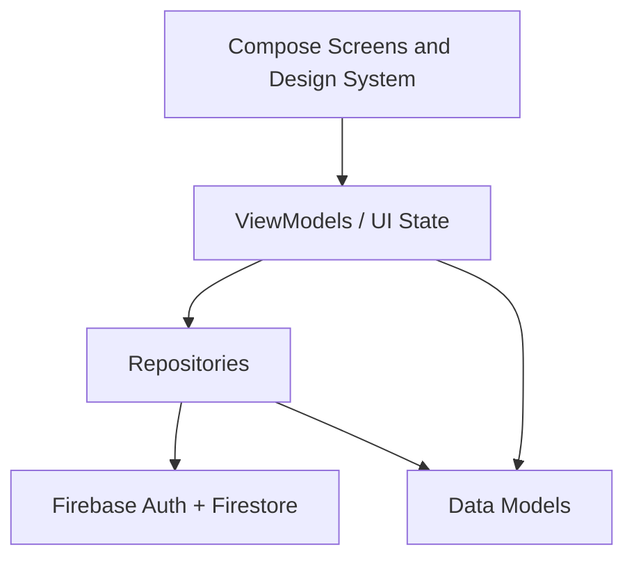

# ChezVous

ChezVous is an Android food ordering and delivery app built for the university mobile development final project. It lets customers browse restaurants, customize meals, place orders, pay through a simulated payment flow, track order status in real time, and lets operational roles manage restaurants, orders, and deliveries.

## Team

- Hatim ed derchoune
- Mouada Zakaria
- Abdelouahab Es-samadi

## Main Features

- Customer registration/login with email and Google Sign-In support.
- Restaurant browsing, menu filtering, cart, checkout, and order history.
- Online card payment interface and cash-on-delivery option.
- Online payment is implemented as a simulated payment flow for academic demonstration.
- Partner dashboard for restaurant settings, menu management, received orders, and preparation status.
- Driver dashboard for available/assigned Firestore delivery orders.
- Safe delivery handoff: `READY_FOR_PICKUP -> PICKED_UP -> ON_THE_WAY -> DELIVERED`.
- Admin dashboard tools for restaurants, drivers, worker invitations, and user role assignment.
- Review-based restaurant ratings after delivered orders.
- Internationalized UI strings in French and English.

## Roles

- `CUSTOMER`: browses restaurants, customizes meals, checks out, tracks orders, and manages profile.
- `PARTNER`: manages assigned restaurants, menu items, and received order preparation.
- `DRIVER`: sees ready/assigned deliveries, validates pickup, and updates delivery status.
- `ADMIN`: manages all restaurants, drivers, worker invitations, and user roles.

Old stored roles are normalized safely:

- `CHEF -> PARTNER`
- `RESTAURANT_ADMIN -> PARTNER`
- unknown or missing role -> `CUSTOMER`

## Technologies

- Kotlin
- Android SDK 35
- Jetpack Compose + Material 3
- MVVM with ViewModels and StateFlow
- Firebase Authentication
- Cloud Firestore
- Google Sign-In / Credential Manager
- Coil for remote images
- ZXing for pickup QR code generation
- Gradle Kotlin DSL

## Architecture



Main packages:

- `presentation`: customer, partner/admin, driver, auth, checkout, profile, orders.
- `data/model`: app models such as user, restaurant, food item, order, driver.
- `data/repository`: Firebase access and business operations.
- `navigation`: role-based navigation and route guards.
- `ui/components`: shared design system components.

## Screenshots

Real screenshots are required for final submission. They should be captured from the emulator or a physical phone after a successful build and placed in `docs/screenshots/`, then linked here.

Required captures:

- Customer home and restaurant details.
- Cart and checkout/payment.
- Order tracking.
- Partner dashboard: menu and received orders.
- Driver dashboard.
- Admin user/driver management.

## How To Run

1. Open the project in Android Studio.
2. Use JDK 21. Android Studio bundled JBR 21 works.
3. Make sure Android SDK 35 is installed and its licenses are accepted.
4. Confirm `app/google-services.json` exists for the Firebase project.
5. Build and run the `app` configuration on an emulator or device.

Command line build:

```powershell
.\gradlew.bat assembleDebug
```

If Gradle asks to download the wrapper or dependencies, allow network access once or build from Android Studio with synced dependencies.

## Firebase And SSO Notes

- Email/password authentication must be enabled in Firebase Auth.
- Google Sign-In requires the correct SHA-1/SHA-256 fingerprints in Firebase and the matching `google-services.json`.
- Facebook SSO is not presented as an active production button unless Firebase/Facebook setup is completed.
- Firestore rules in `firebase/firestore.rules` enforce role access for customers, partners, drivers, and admins.

## Demo Flow

1. `CUSTOMER`: register/login, add menu items to cart, choose payment, create order.
2. `PARTNER`: open assigned restaurant, accept the order, mark preparing, then ready for pickup.
3. `DRIVER`: open driver dashboard, enter/scan pickup code, mark picked up, on the way, delivered.
4. `CUSTOMER`: rate the delivered order to update restaurant review average.
5. `ADMIN`: create restaurants, add worker invitations, manage drivers, and promote/search users by email.

## Current Verification Note

The source is prepared for the four required roles, simulated payment, review-based ratings, and the delivery pipeline. A final submission README still needs real screenshots after the app runs successfully on an emulator/device.
