# ChezVous

**ChezVous** est une application Android de commande et livraison de repas développée dans le cadre du module **Développement Mobile**.

L'application simule un workflow réaliste de livraison de repas en temps réel : le client choisit un restaurant, personnalise son plat, passe une commande, le partenaire prépare la commande, le livreur la récupère, puis le client suit la livraison et peut donner un avis.

---

## Informations du projet

| Élément | Description |
|---|---|
| Nom du projet | ChezVous |
| Type | Application Android mobile |
| Sujet | Commande et livraison de repas en temps réel |
| Module | Développement Mobile Native et Hybride |
| Filière | Master DevOps & Cloud Computing |
| Année universitaire | 2025/2026 |
| Encadrant | Pr. Mohamed Kouissi |

---

## Membres de l'équipe

- **Zakaria Mouada**
- **Hatim ed derchoune**
- **Abdelouahab Es-samadi**

---

## Objectif du projet

L'objectif de ChezVous est de concevoir une application Android moderne, simple et maintenable permettant de coordonner plusieurs acteurs dans un même workflow :

- le **Customer** passe et suit ses commandes ;
- le **Partner** gère le restaurant, le menu et les commandes reçues ;
- le **Driver** récupère et livre les commandes ;
- l'**Admin** gère les utilisateurs, restaurants, livreurs et rôles.

L'application met l'accent sur une expérience mobile propre, une architecture claire et une logique de données connectée à Firebase.

---

## Rôles utilisateurs

### CUSTOMER

Le client peut :

- créer un compte et se connecter ;
- consulter les restaurants partenaires ;
- rechercher, trier et filtrer les menus ;
- consulter les détails d'un restaurant ;
- personnaliser un plat ;
- ajouter des articles au panier ;
- passer au checkout ;
- choisir un paiement simulé ou un paiement à la livraison ;
- suivre l'état de la commande ;
- consulter l'historique des commandes ;
- donner un avis après livraison.

### PARTNER

Le partenaire restaurant peut :

- accéder à son espace restaurant ;
- gérer les informations du restaurant ;
- gérer le menu et la disponibilité des plats ;
- consulter les commandes reçues ;
- faire évoluer les statuts de préparation :

```text
PENDING → ACCEPTED → PREPARING → READY_FOR_PICKUP
```

### DRIVER

Le livreur peut :

- consulter les livraisons disponibles ;
- voir les commandes prêtes à récupérer ;
- valider le code de retrait ;
- mettre à jour l'état de livraison :

```text
READY_FOR_PICKUP → PICKED_UP → ON_THE_WAY → DELIVERED
```

### ADMIN

L'administrateur peut :

- gérer les restaurants ;
- gérer les utilisateurs et les rôles ;
- créer des profils livreurs ;
- ajouter des invitations workers ;
- superviser globalement l'application.

---

## Fonctionnalités principales

- Authentification par email et mot de passe.
- Support Google Sign-In.
- Interface mobile avec Jetpack Compose.
- Design System basé sur Material 3.
- Navigation selon le rôle connecté.
- Gestion des restaurants et menus.
- Personnalisation des plats.
- Gestion du panier.
- Checkout avec paiement simulé ou paiement à la livraison.
- Suivi de commande en temps réel.
- Workflow Partner et Driver.
- Validation par code de retrait.
- Gestion des avis et notes.
- Notifications internes.
- Thème clair / sombre / système.
- Base de données Cloud Firestore.
- Sécurité par rôles avec Firebase Security Rules.

---

## Technologies utilisées

| Technologie | Rôle dans le projet |
|---|---|
| Kotlin | Langage principal de développement Android |
| Android SDK | Accès aux fonctionnalités Android et exécution de l'application |
| Jetpack Compose | Création des écrans avec une UI déclarative moderne |
| Material 3 | Design System : couleurs, typographie, boutons, cartes, chips et navigation |
| MVVM | Séparation entre interface, logique métier et accès aux données |
| ViewModel | Préparation et conservation de l'état des écrans |
| StateFlow | Mise à jour réactive de l'interface |
| Navigation Compose | Navigation entre les écrans de l'application |
| Kotlin Coroutines | Gestion des opérations asynchrones |
| Firebase Authentication | Authentification et sessions utilisateurs |
| Cloud Firestore | Stockage des utilisateurs, restaurants, menus, commandes, livreurs, avis et notifications |
| Google Sign-In | Connexion avec un compte Google |
| AndroidX Credentials / Google Identity | Support du flux moderne de connexion Google |
| Coil Compose | Chargement des images depuis des URLs |
| ZXing QR Code | Gestion de la logique QR/code de retrait |
| Firebase Security Rules | Protection des données selon le rôle connecté |
| Git / GitHub | Gestion de versions et collaboration |

---

## Architecture du projet

Le projet suit une architecture **MVVM** avec séparation des responsabilités.

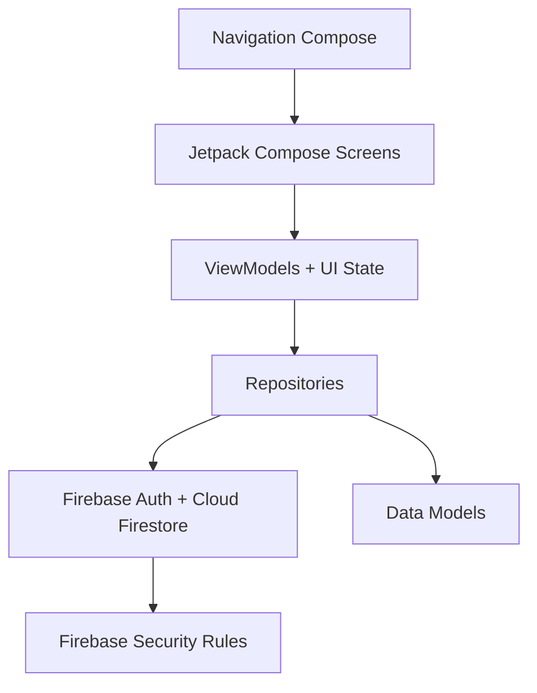

### Organisation générale

```text
app/
└── src/main/java/com/example/chezvous/
    ├── data/
    │   ├── model/
    │   ├── repository/
    │   └── remote/
    ├── di/
    ├── navigation/
    ├── presentation/
    │   ├── auth/
    │   ├── customer/
    │   ├── partner/
    │   ├── driver/
    │   └── admin/
    └── ui/
        ├── components/
        └── theme/
```

### Description des couches

- **presentation** : contient les écrans Jetpack Compose et les ViewModels.
- **data/model** : contient les modèles de données comme User, Restaurant, FoodItem, Order, Driver, Review et Notification.
- **data/repository** : contient la logique d'accès à Firebase et les opérations métier.
- **navigation** : gère les routes et l'accès selon le rôle.
- **ui/components** : contient les composants réutilisables.
- **ui/theme** : contient les couleurs, typographies, espacements et thème global.

---

## Modèle de données Firestore

Collections principales :

```text
users
restaurants
menuItems
orders
drivers
restaurantReviews
notifications
workerInvitations
```

### Exemple : users

```text
id
fullName
email
phone
address
role
managedRestaurantIds
driverId
```

### Exemple : restaurants

```text
id
name
cuisineType
rating
ratingCount
deliveryTime
minimumOrder
imageUrl
address
isOpen
```

### Exemple : orders

```text
id
customerId
customerName
restaurantId
restaurantName
items
subtotal
deliveryFee
totalPrice
deliveryAddress
deliveryNote
paymentMethod
paymentStatus
status
driverId
pickupCode
createdAt
updatedAt
pickedUpAt
deliveredAt
```

---

## Sécurité et accès par rôle

La sécurité est basée sur le rôle de l'utilisateur connecté.

| Rôle | Accès principal |
|---|---|
| CUSTOMER | Créer et lire ses propres commandes, donner un avis après livraison |
| PARTNER | Gérer ses restaurants assignés, menus et statuts de préparation |
| DRIVER | Lire les commandes prêtes, valider le retrait et mettre à jour la livraison |
| ADMIN | Gérer les utilisateurs, rôles, restaurants, livreurs et invitations |

Le but est d'éviter qu'un utilisateur accède à des données ou actions qui ne correspondent pas à son rôle.

---

## Workflow de commande

### Parcours client

```text
Restaurant → Menu → Personnalisation → Panier → Checkout → Suivi → Avis
```

### Workflow Partner

```text
PENDING → ACCEPTED → PREPARING → READY_FOR_PICKUP
```

### Workflow Driver

```text
READY_FOR_PICKUP → PICKED_UP → ON_THE_WAY → DELIVERED
```

---

## Paiement

Le paiement en ligne est implémenté comme un **flux simulé** pour la démonstration académique.

Méthodes proposées :

- paiement en ligne simulé ;
- paiement à la livraison.

L'application ne traite pas de transactions bancaires réelles.

---

## QR / Code de retrait

L'application supporte un système de validation de retrait :

- le Partner voit le code de retrait lorsque la commande est prête ;
- le Driver saisit le code pour valider la récupération ;
- un bouton de scan QR est affiché avec une solution de repli manuelle.

---

## Dépendances et configuration nécessaires

Avant d'exécuter le projet, il faut disposer de :

- Android Studio ;
- JDK compatible avec le projet Android ;
- Android SDK installé ;
- connexion Internet pour télécharger les dépendances Gradle ;
- projet Firebase configuré ;
- fichier `google-services.json` placé dans le dossier `app/` ;
- Firebase Authentication activé ;
- Cloud Firestore activé ;
- Google Sign-In configuré si la connexion Google est testée.

---

## Installation et exécution

1. Cloner le dépôt :

```bash
git clone <URL_DU_DEPOT>
cd Projet-Android-ChezVous
```

2. Ouvrir le projet avec Android Studio.

3. Synchroniser Gradle.

4. Ajouter le fichier Firebase :

```text
app/google-services.json
```

5. Lancer l'application sur un émulateur ou un appareil Android.

6. Vérifier la compilation avec :

```bash
./gradlew assembleDebug
```

Sur Windows :

```bash
gradlew.bat assembleDebug
```

---

## Captures de l'application

Les captures peuvent être placées dans le dossier :

```text
docs/screenshots/
```

Exemples à ajouter :

### Authentification

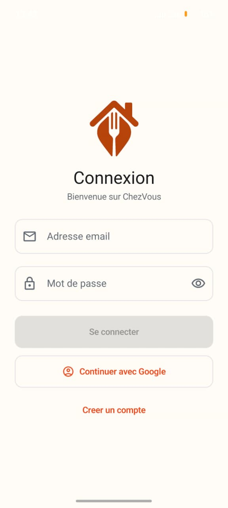

### Accueil client

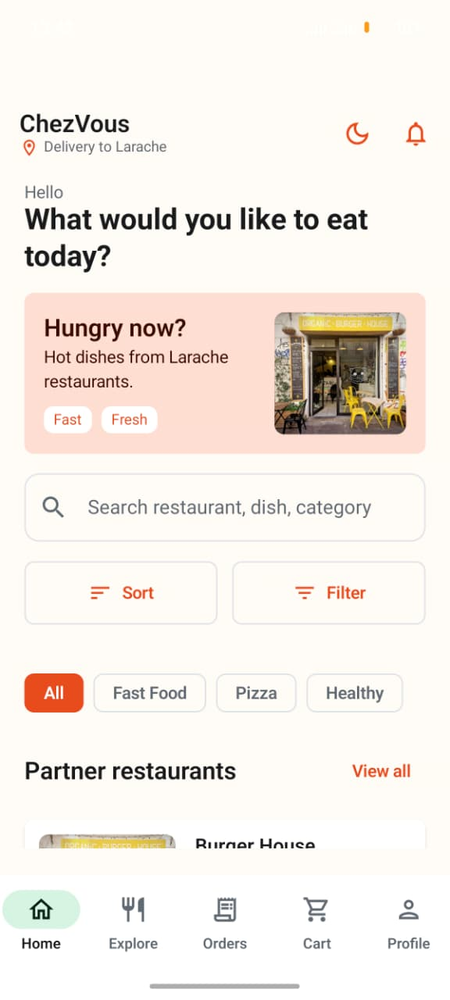

### Détails restaurant

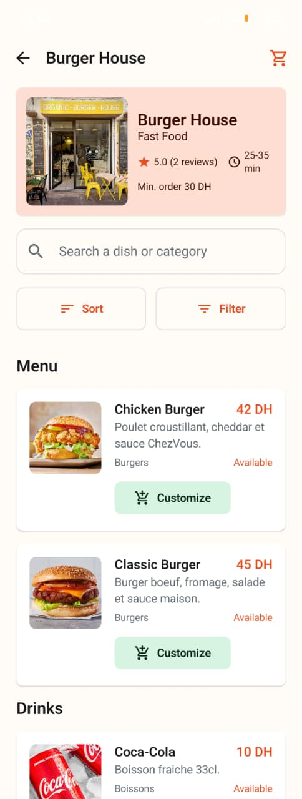

### Personnalisation d'un plat


### Panier

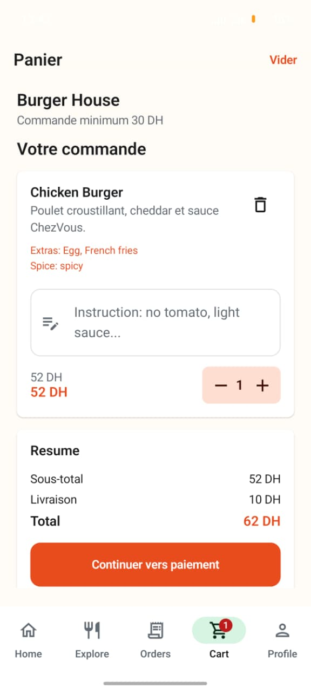

### Checkout / Paiement

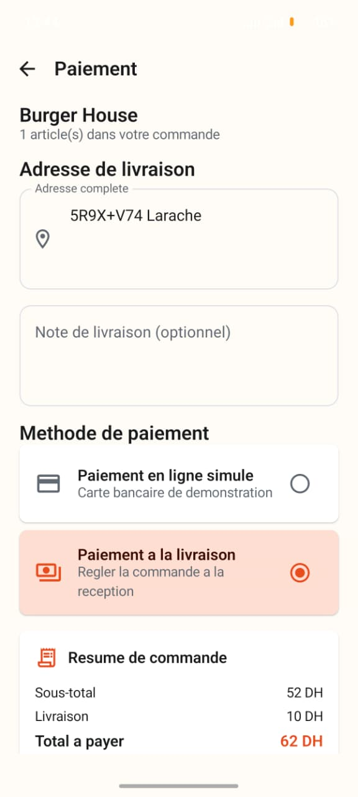

### Suivi de commande

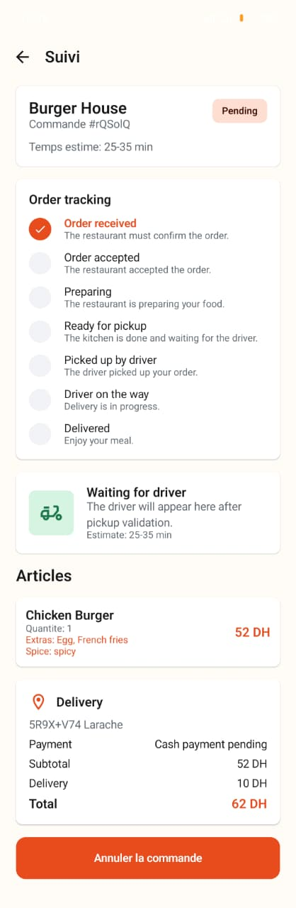
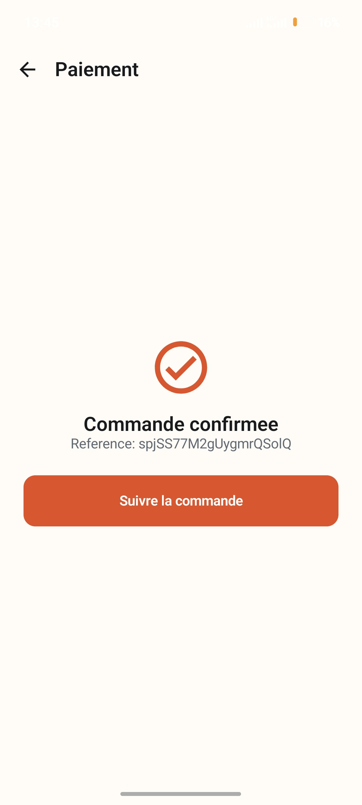

### Espace Partner
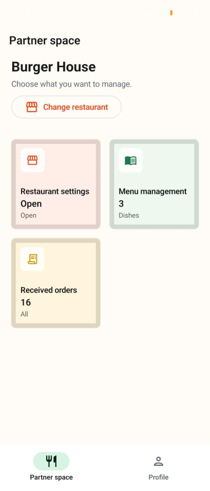
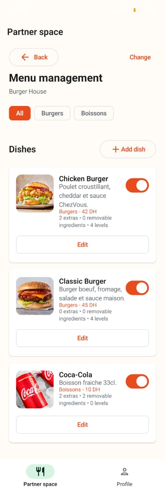
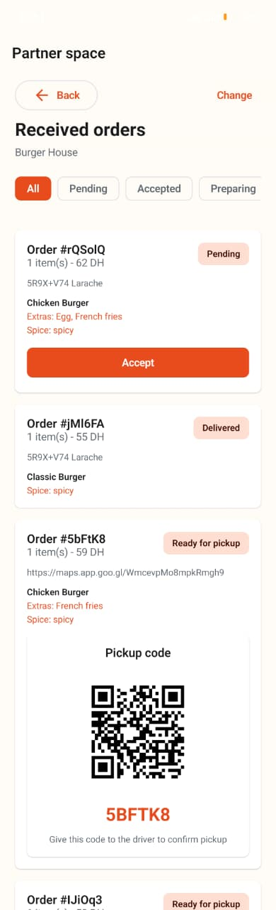
### Espace Driver
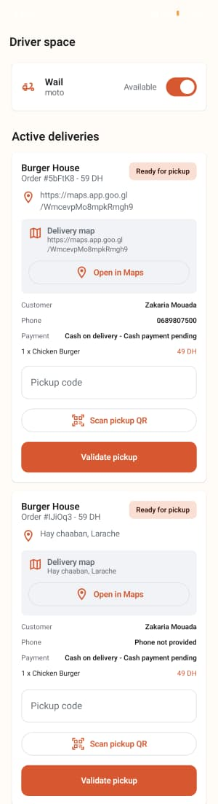

### Administration

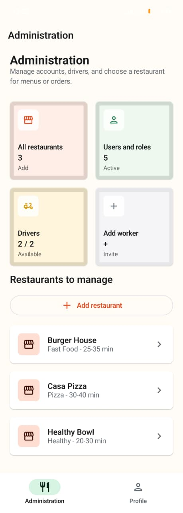

## Démonstration prévue

Scénario de démonstration :

1. Connexion avec un compte Customer.
2. Consultation des restaurants.
3. Choix d'un restaurant et d'un plat.
4. Personnalisation du plat.
5. Ajout au panier.
6. Checkout avec paiement simulé ou paiement à la livraison.
7. Création d'une commande avec le statut `PENDING`.
8. Connexion avec un compte Partner.
9. Validation et préparation de la commande.
10. Passage au statut `READY_FOR_PICKUP`.
11. Connexion avec un compte Driver.
12. Validation du code de retrait.
13. Livraison jusqu'au statut `DELIVERED`.
14. Suivi côté Customer.
15. Ajout d'un avis après livraison.

---

## Limites connues

- Le paiement bancaire réel n'est pas intégré.
- Le scan caméra QR réel n'est pas activé si la dépendance caméra n'est pas configurée.
- Le projet doit être testé localement avec `assembleDebug` avant la remise finale.
- Les rôles actifs présentés sont uniquement : `CUSTOMER`, `PARTNER`, `DRIVER`, `ADMIN`.

---

## Perspectives d'amélioration

- Intégration d'un vrai fournisseur de paiement.
- Notifications push avec Firebase Cloud Messaging.
- Scanner QR réel avec caméra.
- Suivi GPS en temps réel.
- Tableau de bord analytique pour les restaurants.
- Support multilingue complet.
- Tests unitaires et tests UI plus avancés.

---

## Conclusion

ChezVous propose une application Android mobile complète autour d'un workflow réaliste :

```text
commande → préparation → livraison → suivi → avis
```

Le projet respecte une architecture moderne avec **Jetpack Compose**, **MVVM**, **Firebase Authentication** et **Cloud Firestore**, tout en gardant une structure simple et maintenable pour un projet académique de développement mobile.
